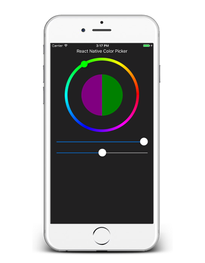

# react-native-color-picker

React Native implementation of color picker for both Android and iOS.




* [x] works both in controlled and uncontrolled way
* [x] old color can be displayed for visual comparison
* [x] holo and triangle color pickers

## Getting started
Install the color picker

```
npm install react-native-color-picker --save
```

And use it in your application

```javascript
import { ColorPicker } from 'react-native-color-picker'

const Picker = () => (
  <ColorPicker
    onColorSelected={color => alert(`Color selected: ${color}`)}
    style={{flex: 1}}
  />
)
```

Color picker will use space you provide. Therefore it is necessary to provide styles that will determine picker's size.

For HoloPicker (`ColorPicker`) you might need to install `@react-native-community/slider` and pass it (or any other Slider compatible component) as `sliderComponent` prop if you don't want to use deprecated RN `Slider`.

## API

### Color picker type

We provide two types of color picker - holo (default) and triangle color picker. Both has the same API so that they are interchangable. Just import it and use it the same way:

```javascript
import { ColorPicker, TriangleColorPicker } from 'react-native-color-picker'
```

| ColorPicker | TriangleColorPicker |
| ----------- | ------------------- |
|  |  |


### Props

Color pickers accepts properties below. Each property which define color is represented as a [color string](https://github.com/bgrins/TinyColor#accepted-string-input).

Both color pickers are [PureComponents](https://facebook.github.io/react/docs/react-api.html#react.purecomponent) thus if you want to update it you should not mutate its properties deeply.

| Property | Type | Note |
|--------------------|------------|--------|
|`color`             |`String\|HSV`|[Color string](https://github.com/bgrins/TinyColor#accepted-string-input) or HSV object (see below). Defines selected color in controlled component. |
|`defaultColor`      |`String`    |Defines initial selected color in uncontrolled component.|
|`oldColor`          |`String`    |Old color to be used for visual comparision. If it is not defined, whole circle is representing selected color.|
|`style`             |`Style`     |Styles passed to color picker container|
|`onColorSelected`   |`Function`  |Callback with color (HEX string) as argument called when user confirms color selection.|
|`onColorChange`     |`Function`  |Callback called each time when color is changed. Used in controlled component. Argument is color in HSV representation (see below)|
|`onOldColorSelected`|`Function`  |Callback with color (HEX string) as argument called when user selects old color.|
|`hideSliders`       |`Boolean`   |Option to hide bottom sliders (holo picker only) |
|`hideControls`      |`Boolean`   |Option to hide bottom buttons (triangle picker only) |

When using color picker as a controlled component you should always use HSV color representation to avoid conversion from/to HEX or RGB. HSV color representation is an object literal with properties:

```javascript
{
  h: number, // <0, 360>
  s: number, // <0, 1>
  v: number, // <0, 1>
}

```

### Helper functions

To utilize HSV -> HEX/RGB conversion we provide helper functions:

```javascript
import { toHsv, fromHsv } from 'react-native-color-picker'

toHsv('blue') // { h: 24, s: 1, v: 1 }

fromHsv({ h: 200, s: 0.4, v:0.4 }) // #3d5866

```

## Examples

See our examples on [Expo](https://snack.expo.io/@sodik82/react-native-color-picker-example)


## Limitations
* Does not work well within `ScrollView` due to touch event interference.
* RN has deprecated `Slider` component. You need to provide Slider component as prop to overcome this. 
* There is known [bug](https://github.com/instea/react-native-color-picker/issues/17) affecting RN 0.61. See more info about the workaround. 

## Thanks
Our implementation was inspired by [Android Holo ColorPicker](https://github.com/LarsWerkman/HoloColorPicker)
